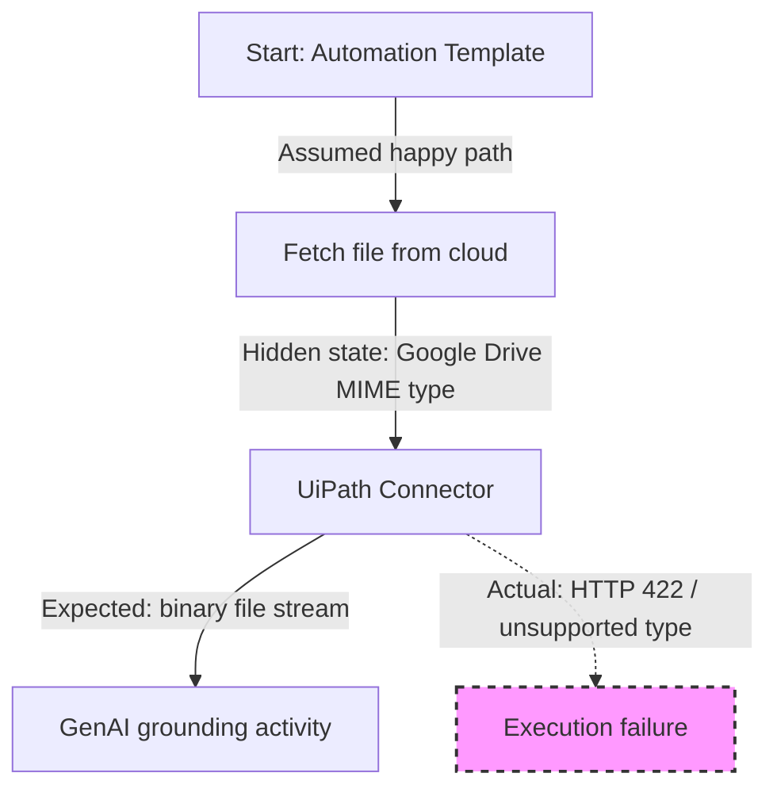

# Day 07 — 2026-01-12

**Focus:** Reliability engineering & reframing how systems fail  
**Primary source:** “How Complex Systems Fail” — Dr. Richard I. Cook  
**Time spent:** ~1 hour (lecture + analysis)

---

## What I did today
- Watched **“How Complex Systems Fail”** by **Dr. Richard I. Cook**  
  - Source: https://youtu.be/2S0k12uZR14
- Revisited the failures from Day 02 and Day 06 using a systems-thinking lens, focusing on *why failures emerged* rather than *how to patch them*.

---

## Core engineering ideas explored
- Complex systems rarely fail due to a single mistake; failures emerge from **interactions between components, assumptions, and constraints**.
- Systems often operate in a *degraded but functional state* long before failure becomes visible.
- Human operators (developers, analysts) routinely adapt systems beyond their original design intent.

---

## Mapping theory to my Day-06 failure

### The latent failure model (Dr. Cook)
Systems contain hidden weaknesses (“latent failures”) that remain invisible until multiple conditions align.

| Principle | Theory | My Observation |
|---------|--------|----------------|
| **Degraded mode** | Systems appear to work while already compromised | My Studio Web setup functioned for basic tasks, masking Google Drive vs OneDrive incompatibilities |
| **Invisible safety boundaries** | You don’t know you crossed a boundary until failure occurs | I assumed cloud-stored `.docx` files behaved identically across providers |
| **No single root cause** | Failures emerge from interactions, not one bug | The issue was not “bad code” but an integration boundary mismatch |

---

## Structural view of the failure chain

> This failure was structural, not logical.
## Why this matters to my work
This reframing changed how I interpret automation errors:
- The OAuth and file-handling issues were boundary failures, not isolated bugs.
- Templates encode implicit assumptions about environment and tooling.
- Documentation must make those assumptions explicit, or users will discover them through failure.

This explains why:
- Templates can be logically correct yet operationally fragile.
- Debugging often requires examining context and system design, not just error messages.
- “Fixing the error” without understanding the system often creates new failure modes

---

## Actionable takeaways for Week 2
- Defensive validation: Explicitly validate file type and environment assumptions before downstream processing.
- Constraint-aware logging: Log environmental constraints, not just execution errors.
- Work-as-imagined vs work-as-done: Treat documentation gaps as engineering problems, not user mistakes.

---
## Reflection
Today was intentionally non-execution focused.
The goal was to improve judgment before proceeding with further labs, weekly review synthesis, and potential open-source contributions.
This perspective will directly inform how I:
- Document errors and constraints
- Write future learning logs
- Evaluate template-based automations before adapting them
